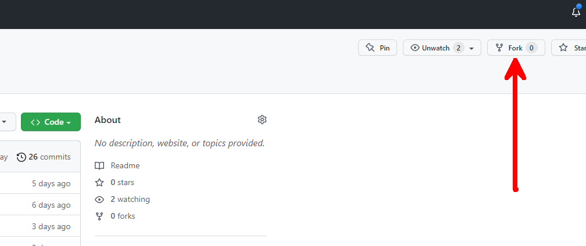
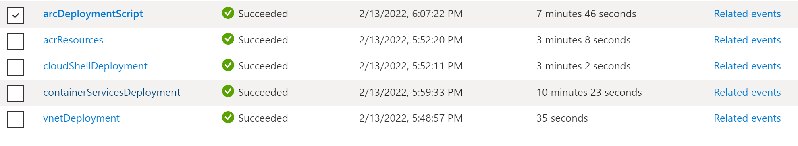

# App Innovation Landing Zone with Kubernetes, GitHub, and Java

## Overview of Landing Zone and Applied Patterns

1. [Infrastructure-as-Code](https://docs.microsoft.com/en-us/devops/deliver/what-is-infrastructure-as-code) with [Azure Bicep](https://github.com/Azure/bicep)

2. [Private Azure Kubernetes Service](https://docs.microsoft.com/en-us/azure/aks/private-clusters)

3. [GitOps with Flux v2](https://docs.microsoft.com/en-us/azure/azure-arc/kubernetes/conceptual-gitops-flux2)

4. [GitHub Self-Hosted Runners in Containers](https://github.com/actions-runner-controller/actions-runner-controller)

    - To further show patterns here, we are leveraging a [custom image](./gitops/github-runner/Dockerfile) since there are certains tools needed in the runner that are not pre-installed by the actions-runner-controller base image.

5. [Private-Endpoint Enabled ACR with ACR Build Tasks](https://docs.microsoft.com/en-us/azure/container-registry/container-registry-tasks-overview)

    - To support our private, enterprise deployment we create ACR with a Private Endpoint within the VNET.

    - ACR Tasks can be used for your custom builds and can also run import jobs so that upstream images/artifacts/helm charts are pulled locally to your secure ACR instance.
    
    - Since ACR is exposed only through a private endpoint, we need to find a way to enable ACR Tasks to communicate with ACR. There are a few different ways to accomplish this:

        1. Use a managed identity for the ACR Task and ensure that your ACR instance enables access from [Trusted Services](https://docs.microsoft.com/en-us/azure/container-registry/allow-access-trusted-services#trusted-services).

            > Currently this repo demonstrates this approach with a managed identity on the ACR Task

        2. Use Azure Container Instances with a managed identity and ensure that your ACR instance enables access from [Trusted Services](https://docs.microsoft.com/en-us/azure/container-registry/allow-access-trusted-services#trusted-services).

        3. Run jobs from within AKS to communicate to ACR through the az cli (could levage Pod Identities to provide permissions to the job based on it's desired functionality).

## Architecture


## Deployment Steps

1. Fork the repo to your personal org:

    

2. Clone the repo and navigate to the `infra` directory (`cd enterprise-kubernetes-patterns/infra`):

    ```bash
    #clone the repo
    git clone <FORKED REPO URL>
    cd ./infra
    ```

3. Login to Azure from your terminal:

    ```bash
    #Follow prompt to login
    az login --use-device-code
    ```

4. Run the following to obtain the ACI Object ID Needed to inject cloud shell into VNET:

    > Reference: [Cloud Shell in VNET Template](https://azure.microsoft.com/en-us/resources/templates/cloud-shell-vnet/)
    > Works for both US Government and Azure Commercial Clouds

    ```bash
    #Make sure the resource provider is registered
    az provider register --namespace 'Microsoft.ContainerInstance'

    #Wait until you see the following command showing a RegistrationState of 'Registered'
    az provider show -n Microsoft.ContainerInstance -o table

    #Once registered, run the following and copy the objectID that appears as output
    az ad sp list \
    --display-name 'Azure Container Instance' \
    -o tsv \
    --filter "appid eq '6bb8e274-af5d-4df2-98a3-4fd78b4cafd9'" \
    --query [0].objectId
    ```

5. Create an SSH Public-Private key pair to use for AKS:

    > Reference: [AKS Create SSH Key Pair](https://docs.microsoft.com/en-us/azure/aks/kubernetes-walkthrough-rm-template#create-an-ssh-key-pair)

    > Be sure not to commit these key files to your repo

    ```bash
    # the public key will be passed as a parameter to the bicep deployment
    ssh-keygen -t rsa -b 4096
    ```

6. Generate a [Personal Access Token](https://docs.github.com/en/authentication/keeping-your-account-and-data-secure/creating-a-personal-access-token) for the Self-Hosted GitHub Runners. The agent token will require repo (full control) scopes if using a repository runner. Copy the token so that you can paste it for your paramters file.

7. Register the following resource providers:

    ```bash
    az feature register --namespace Microsoft.ContainerService --name AKS-ExtensionManager
    az provider register --namespace Microsoft.Kubernetes
    az provider register --namespace Microsoft.KubernetesConfiguration
    az provider register --namespace Microsoft.ContainerService

    #Once the following shows 'Registered', run the registration on containerservice to propogate change
    az feature show --namespace Microsoft.ContainerService --name AKS-ExtensionManager
    az provider show -n Microsoft.Kubernetes -o table
    az provider show -n Microsoft.KubernetesConfiguration -o table
    az provider show -n Microsoft.ContainerService -o table

    #You can proceed to next step once the following shows 'Registered'
    az feature show --namespace Microsoft.ContainerService --name AKS-ExtensionManager
    az provider show -n Microsoft.ContainerService -o table
    ```

8. Copy the `main.parameters.json` file to `local.parameters.json` and specify your values. From there, run the following command:

    > Be sure not to commit your `local.paramters.json` file that you will create below. All files starting with `local*` are ignored - you can see this in the local `.gitignore`.

    ```bash
    # copy main.parameters.json to local.parameters.json
    # apply custom values to local.parameters.json
    cp main.parameters.json local.parameters.json

    # run deployment from your location
    export LOCATION=eastus

    az deployment sub create \
    --name app-innovation-deployment-`date +"%Y-%m-%d-%s"` \
    --template-file main.bicep \
    --parameters local.parameters.json \
    --location $LOCATION
    ```

    > As the bicep deployment is running, you can track the progress in the portal

    

## References

* [Reference on how to connect to the cloud shell within the VNET](https://docs.microsoft.com/en-us/azure/cloud-shell/private-vnet#configuring-cloud-shell-to-use-a-virtual-network)