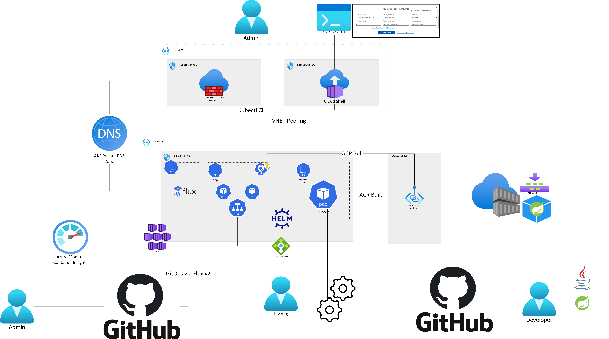

# App Innovation Landing Zone with Kubernetes, GitHub, and Java

## Getting Started

1. Run the commands specified in the [infra deployment instructions](./infra/README.md) to deploy the following with Bicep:

