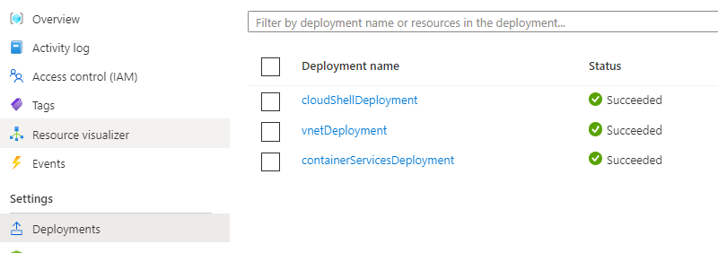

# Deploy Infra for Landing Zone

Run all the following commands from the `infra` directory (`cd ./infra`).

1. Run the following to obtain the ACI Object ID Needed to inject cloud shell into VNET:

    > Reference: [Cloud Shell in VNET Template](https://azure.microsoft.com/en-us/resources/templates/cloud-shell-vnet/)
    > Works for both US Government and Azure Commercial Clouds

    ```bash
    az ad sp list --display-name 'Azure Container Instance' -o table --filter "appid eq '6bb8e274-af5d-4df2-98a3-4fd78b4cafd9'"
    ```

2. Create an SSH Public-Private key pair to use for AKS:

    > Reference: [AKS Create SSH Key Pair](https://docs.microsoft.com/en-us/azure/aks/kubernetes-walkthrough-rm-template#create-an-ssh-key-pair)

    ```bash
    # the public key will be passed as a parameter to the bicep deployment
    ssh-keygen -t rsa -b 4096
    ```

3. Generate a [Personal Access Token](https://docs.github.com/en/authentication/keeping-your-account-and-data-secure/creating-a-personal-access-token) for the Self-Hosted GitHub Runners. The agent token will require repo (full control) scopes if using a repository runner. Copy the token so that you can paste it for your paramters file.

4. Copy the `main.parameters.json` file to `local.parameters.json` and specify your values. From there, run the following command:

    ```bash
    # copy main.parameters.json to local.parameters.json
    # apply custom values to local.parameters.json
    cp main.parameters.json local.parameters.json

    # run deployment from your location
    export LOCATION=eastus

    az deployment sub create \
    --name app-innovation-deployment-`date +"%Y-%m-%d-%s"` \
    --template-file main.bicep \
    --parameters local.parameters.json \
    --location $LOCATION
    ```

    > As the bicep deployment is running, you can track the progress in the portal

    

# References

* [Reference on how to connect to the cloud shell within the VNET](https://docs.microsoft.com/en-us/azure/cloud-shell/private-vnet#configuring-cloud-shell-to-use-a-virtual-network)